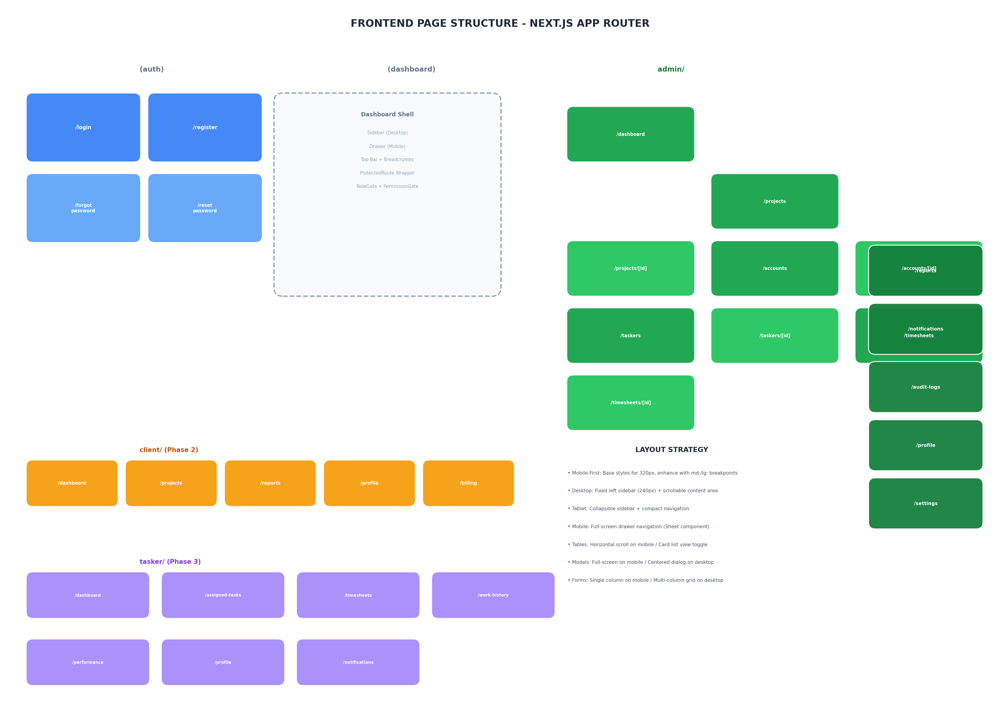
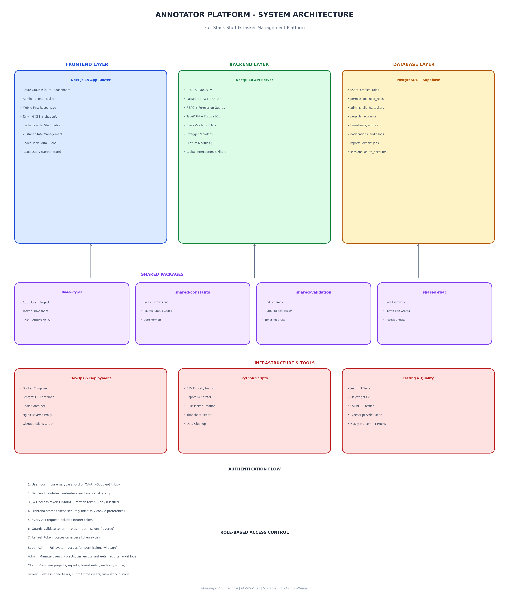
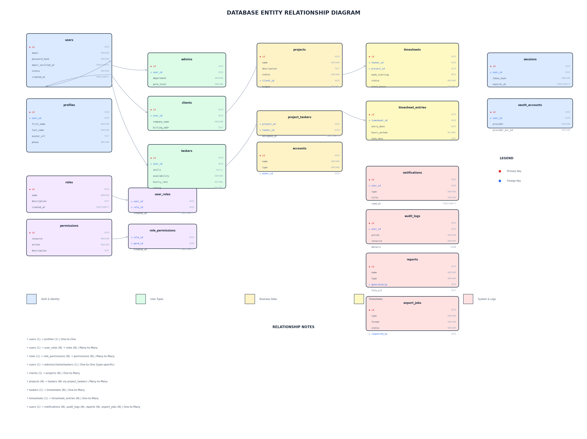

# Annotator Platform - Project Architecture & Skeleton

## 1. Architectural Overview

The Annotator Platform is a **full-stack staff and tasker management system** built as a scalable monorepo. It is designed to support three distinct user roles across separate dashboard experiences:

- **Admin Dashboard** (Phase 1 - Current Focus)
- **Client Dashboard** (Phase 2 - Future)
- **Tasker / Annotator Dashboard** (Phase 3 - Future)

### Core Design Principles
1. **Mobile-First Responsive Design** - All UI is designed for mobile (320px+) first, then enhanced for tablet and desktop via Tailwind breakpoints.
2. **Role-Based Access Control (RBAC)** - Every route, API endpoint, and UI element is guarded by authentication, role checks, and permission checks.
3. **Modular Backend Architecture** - NestJS feature modules with clear boundaries, DTOs, entities, and tests per module.
4. **API-First Development** - Versioned REST API with Swagger documentation, consistent response formats, and pagination standards.
5. **Shared Packages** - Types, constants, validation schemas, RBAC definitions, and utilities are shared across frontend and backend.

### Technology Stack
| Layer | Technology |
|-------|-----------|
| Frontend | Next.js 15 (App Router), TypeScript, Tailwind CSS, shadcn/ui |
| Backend | NestJS 10, TypeScript, TypeORM, PostgreSQL |
| Database | PostgreSQL 16, Supabase (optional managed) |
| Auth | JWT (access + refresh), OAuth 2.0 (Google/GitHub) |
| State | Zustand (client), React Query (server) |
| Validation | Zod (frontend), class-validator (backend) |
| Testing | Jest, Playwright, React Testing Library |
| DevOps | Docker Compose, Redis, Nginx |

---

## 2. Page Structure Diagram



### Route Groups (Next.js App Router)

```
app/
├── (auth)/                    # No dashboard shell, minimal layout
│   ├── login/
│   ├── register/
│   ├── forgot-password/
│   └── reset-password/
│
├── (dashboard)/               # Shared dashboard shell with sidebar/drawer
│   ├── layout.tsx             # ProtectedRoute + DashboardShell
│   │
│   ├── admin/                 # PHASE 1 - Admin Dashboard
│   │   ├── dashboard/         # Analytics with day/week/month/year filters
│   │   ├── projects/          # List + create modal
│   │   ├── projects/[projectId]/
│   │   ├── accounts/
│   │   ├── accounts/[accountId]/
│   │   ├── taskers/
│   │   ├── taskers/[taskerId]/
│   │   ├── users/[userId]/
│   │   ├── timesheets/
│   │   ├── timesheets/[timesheetId]/
│   │   ├── reports/
│   │   ├── notifications/
│   │   ├── audit-logs/
│   │   ├── profile/           # Admin's own profile
│   │   └── settings/
│   │
│   ├── client/                # PHASE 2 - Client Dashboard
│   │   ├── dashboard/
│   │   ├── projects/
│   │   ├── reports/
│   │   ├── profile/
│   │   └── billing/
│   │
│   └── tasker/                # PHASE 3 - Tasker Dashboard
│       ├── dashboard/
│       ├── assigned-tasks/
│       ├── timesheets/
│       ├── work-history/
│       ├── performance/
│       ├── profile/
│       └── notifications/
```

---

## 3. System Architecture Diagram



### Data Flow
1. **User** accesses the Next.js frontend (Vercel or self-hosted)
2. **Frontend** makes API calls to `/api/v1/*` on the NestJS backend
3. **Backend** validates JWT → checks roles → checks permissions → executes business logic
4. **TypeORM** queries the PostgreSQL database
5. **Supabase** optionally provides auth, storage, or realtime features
6. **Redis** handles sessions, caching, and rate limiting
7. **Python scripts** run async export/report jobs via cron or queue workers

### Authentication Flow
1. User logs in via email/password or OAuth (Google/GitHub)
2. Backend validates via Passport strategy
3. JWT access token (15min) + refresh token (7days) issued
4. Frontend stores tokens securely (httpOnly cookie preference)
5. Every API request includes Bearer token
6. Guards validate: token → roles → permissions (layered)
7. Refresh token rotates on access token expiry

---

## 4. Database Relationship Plan



### Core Entities

| Entity | Purpose | Key Relations |
|--------|---------|--------------|
| `users` | Core authentication | 1:1 profiles, 1:N sessions/oauth_accounts |
| `profiles` | Extended user info | Belongs to users |
| `roles` | Role definitions | N:M users via user_roles |
| `permissions` | Permission definitions | N:M roles via role_permissions |
| `admins` | Admin-specific data | 1:1 users |
| `clients` | Client-specific data | 1:1 users, 1:N projects |
| `taskers` | Tasker-specific data | 1:1 users, N:M projects |
| `projects` | Project definitions | N:M taskers via project_taskers |
| `accounts` | Account/organization | 1:1 owner (user) |
| `timesheets` | Weekly timesheets | 1:N timesheet_entries, 1:1 tasker |
| `notifications` | User notifications | 1:1 user |
| `audit_logs` | System audit trail | 1:1 user |
| `reports` | Generated reports | 1:1 generated_by (user) |
| `export_jobs` | Async export jobs | 1:1 requested_by (user) |
| `sessions` | Active JWT sessions | 1:1 user |
| `oauth_accounts` | OAuth provider links | 1:1 user |

### Relationship Types
- **One-to-One**: users → profiles, users → admins/clients/taskers
- **One-to-Many**: clients → projects, taskers → timesheets, users → notifications/audit_logs
- **Many-to-Many**: users → roles, roles → permissions, projects → taskers

---

## 5. Complete Monorepo Folder Tree

```
annotator-platform/
├── apps/
│   ├── frontend/                    # Next.js 15 + TypeScript + Tailwind
│   │   ├── app/
│   │   │   ├── (auth)/              # Auth pages (no shell)
│   │   │   │   ├── login/
│   │   │   │   ├── register/
│   │   │   │   ├── forgot-password/
│   │   │   │   └── reset-password/
│   │   │   ├── (dashboard)/         # Dashboard shell wrapper
│   │   │   │   ├── layout.tsx       # ProtectedRoute + DashboardShell
│   │   │   │   ├── admin/           # Phase 1 - Admin routes
│   │   │   │   ├── client/          # Phase 2 - Client routes
│   │   │   │   └── tasker/          # Phase 3 - Tasker routes
│   │   │   ├── globals.css
│   │   │   └── layout.tsx           # Root layout with ThemeProvider
│   │   ├── components/
│   │   │   ├── ui/                  # shadcn/ui primitives
│   │   │   ├── layout/              # DashboardShell, Sidebar, MobileDrawer
│   │   │   ├── shared/              # ProtectedRoute, ThemeProvider, RoleGate
│   │   │   ├── forms/               # Business forms (project, tasker, etc.)
│   │   │   ├── modals/              # Modal dialogs
│   │   │   ├── tables/              # DataTable, ResponsiveTable, CardList
│   │   │   ├── cards/               # StatCard, ProjectCard, EmptyStateCard
│   │   │   ├── charts/              # AnalyticsChart, Recharts wrappers
│   │   │   └── empty-states/        # Empty state illustrations
│   │   ├── hooks/                   # Custom React hooks (useAuth, useProjects, etc.)
│   │   ├── lib/                     # Core utilities (cn, api client, supabase)
│   │   ├── stores/                  # Zustand stores (auth, ui, notifications)
│   │   ├── types/                   # Frontend-specific types
│   │   ├── constants/               # Frontend constants
│   │   ├── utils/                   # Helper utilities
│   │   ├── services/                # API service layer
│   │   ├── validations/             # Zod schemas
│   │   ├── public/                  # Static assets
│   │   ├── styles/                  # Global styles
│   │   └── tests/                   # Unit, integration, e2e tests
│   │
│   └── backend/                     # NestJS 10 API Server
│       ├── src/
│       │   ├── modules/             # Feature modules (16 total)
│       │   │   ├── auth/            # JWT, OAuth, Passport strategies
│       │   │   ├── users/           # User management
│       │   │   ├── profiles/        # Profile management
│       │   │   ├── admins/          # Admin records
│       │   │   ├── clients/         # Client records
│       │   │   ├── taskers/         # Tasker records
│       │   │   ├── projects/        # Project management
│       │   │   ├── accounts/        # Account/organization
│       │   │   ├── timesheets/      # Timesheet management
│       │   │   ├── dashboard-analytics/  # Analytics aggregation
│       │   │   ├── reports/         # Report generation
│       │   │   ├── exports/         # Export jobs
│       │   │   ├── notifications/   # Notification system
│       │   │   ├── audit-logs/      # Audit logging
│       │   │   ├── roles/           # Role management
│       │   │   ├── permissions/     # Permission management
│       │   │   ├── supabase/        # Supabase integration
│       │   │   └── health/          # Health checks
│       │   ├── common/              # Cross-cutting concerns
│       │   │   ├── decorators/      # @Roles, @Permissions, @CurrentUser, @Public
│       │   │   ├── filters/         # Exception filters
│       │   │   ├── guards/          # RolesGuard, PermissionsGuard
│       │   │   ├── interceptors/    # Transform, Logging
│       │   │   ├── middleware/      # RequestId, RateLimit
│       │   │   ├── pipes/           # Validation pipes
│       │   │   └── utils/           # Password, JWT utilities
│       │   ├── config/              # App, DB, JWT, Supabase configs
│       │   ├── database/            # TypeORM data source, seeds
│       │   ├── app.module.ts        # Root module
│       │   └── main.ts              # Bootstrap
│       └── test/                    # Unit, e2e, integration tests
│
├── packages/                        # Shared workspace packages
│   ├── shared-types/                # TypeScript interfaces (Auth, User, Project, etc.)
│   ├── shared-constants/            # Roles, permissions, routes, status codes
│   ├── shared-validation/         # Zod schemas used on both sides
│   ├── shared-rbac/               # Role hierarchy, permission grants, access checks
│   └── shared-utils/              # Date, string, number, array utilities
│
├── database/                        # Database layer
│   ├── supabase/                    # Supabase config
│   ├── migrations/                  # TypeORM migration files
│   ├── seeds/                       # Seed data (roles, admin, test data)
│   └── schemas/                     # SQL schema files (users, projects, etc.)
│
├── scripts/                         # Automation scripts
│   ├── python/                      # Python utilities
│   │   ├── exports/                 # CSV export
│   │   ├── imports/                 # CSV import
│   │   ├── reports/                 # PDF/Excel report generation
│   │   ├── bulk-ops/                # Bulk tasker creation
│   │   ├── cleanup/                 # Data cleanup
│   │   └── utils/                   # Shared Python utilities
│   └── bash/                        # Shell scripts (backup, restore)
│
├── docker/                          # Docker configurations
│   ├── frontend/Dockerfile
│   ├── backend/Dockerfile
│   ├── database/init/
│   └── nginx/nginx.conf
│
├── docs/                            # Documentation
│   ├── architecture/                # System diagrams
│   ├── frontend/                      # Frontend patterns
│   ├── backend/                       # Backend patterns
│   ├── database/                      # Schema docs
│   ├── api/                           # API contracts
│   ├── deployment/                    # Deployment guides
│   ├── testing/                       # Testing strategy
│   └── design/                        # Design system
│
├── .env.example                     # Environment template
├── docker-compose.yml               # Local infrastructure
├── package.json                     # Workspace root (npm workspaces)
├── turbo.json                       # Turborepo pipeline config
├── .eslintrc.json                   # Root ESLint config
├── .prettierrc                      # Prettier config
├── .gitignore
├── README.md
└── TREE.txt                         # Full directory tree
```

---

## 6. Major Folder Explanations

### `apps/frontend/`
The Next.js 15 application using the App Router. Key architectural decisions:
- **Route groups** `(auth)` and `(dashboard)` isolate layout concerns
- **Dashboard shell** provides consistent navigation, headers, and protection
- **Component folders** are organized by function, not by page
- **Mobile-first**: Base styles target mobile; `md:` and `lg:` enhance desktop

### `apps/backend/`
The NestJS API server with 16 feature modules. Each module follows the same structure:
- `*.module.ts` - NestJS module definition
- `*.controller.ts` - HTTP route handlers with Swagger decorators
- `*.service.ts` - Business logic and database interactions
- `dto/` - Request/response data transfer objects with class-validator rules
- `entities/` - TypeORM entity classes mapping to PostgreSQL tables
- `*.spec.ts` - Jest unit tests

### `packages/shared-*/`
Five shared packages consumed by both frontend and backend:
- **shared-types**: Single source of truth for TypeScript interfaces
- **shared-constants**: Route paths, roles, permissions, status codes
- **shared-validation**: Zod schemas validated on both frontend (forms) and backend (API)
- **shared-rbac**: Role hierarchy and permission checking logic
- **shared-utils**: Pure functions for dates, strings, numbers, arrays

### `database/`
PostgreSQL schema definitions, migration journal, and seed scripts. Organized separately from backend entities to maintain clarity between ORM entities and raw SQL.

### `scripts/python/`
Optional Python utilities for heavy data operations: CSV exports, report generation, bulk imports, and data cleanup. These can run as cron jobs or be triggered via the backend queue.

### `docker/`
Multi-stage Dockerfiles for production builds, plus nginx reverse proxy configuration and database initialization scripts.

---

## 7. Recommendations for Scaling Later

### Phase 2: Client Dashboard
1. **Frontend**: Add routes under `app/(dashboard)/client/*` with a `ClientNav` component
2. **Backend**: Extend `ClientsModule` with client-scoped endpoints (`/clients/me/projects`)
3. **Database**: No schema changes needed; use existing `clients` and `projects` tables with `WHERE client_id = ?`
4. **RBAC**: Client role already defined in `shared-rbac`; permissions are read-only for most resources

### Phase 3: Tasker Dashboard
1. **Frontend**: Add routes under `app/(dashboard)/tasker/*` with `TaskerNav`
2. **Backend**: Extend `TaskersModule` with tasker-scoped endpoints (`/taskers/me/assigned-tasks`)
3. **Database**: Leverage existing `project_taskers` junction table and `timesheets` table
4. **RBAC**: Tasker permissions already mapped; only needs `timesheets:create` and `timesheets:update`

### Scaling Architecture
- **Horizontal scaling**: Backend is stateless; scale via Docker containers behind a load balancer
- **Database**: Add read replicas for analytics/report queries; connection pooling via PgBouncer
- **Caching**: Redis for session storage, API response caching, and rate limiting
- **File storage**: Supabase Storage or S3 for avatars, report files, and export downloads
- **Queue system**: Introduce BullMQ or RabbitMQ for async exports, notifications, and report generation
- **Monitoring**: Add Pino logging + centralized log aggregation (Datadog, Sentry)

---

## 8. Mobile-First Consistency Notes

### Why Mobile-First Matters
The admin dashboard must be fully usable on mobile because admins may need to approve timesheets, review notifications, or check project status while away from their desks.

### Implementation Strategy
1. **Breakpoints**: Mobile base → `md:` (768px) tablet → `lg:` (1024px) desktop
2. **Navigation**: 
   - Desktop: Fixed left sidebar (240px width)
   - Tablet: Collapsible sidebar with overlay
   - Mobile: Full-screen drawer (Sheet component from shadcn/ui)
3. **Tables**:
   - Desktop: Full data table with sorting, filtering, pagination
   - Mobile: Horizontal scroll OR toggle to card list view
4. **Modals**:
   - Desktop: Centered dialog with backdrop
   - Mobile: Bottom sheet or full-screen modal
5. **Forms**:
   - Mobile: Single column, large touch targets (min 44px), native input types
   - Desktop: Multi-column grid where appropriate
6. **Charts**:
   - Mobile: Simplified charts, swipeable tabs for different metrics
   - Desktop: Full dashboard with side-by-side charts
7. **Testing**: Use Playwright to test critical flows at 375px, 768px, and 1440px viewports

---

## 9. Project Skeleton Status

| Component | Status |
|-----------|--------|
| Frontend folder structure | Complete |
| Frontend placeholder pages | Complete (all routes) |
| Frontend components skeleton | Complete |
| Frontend hooks/services/stores | Complete |
| Backend module structure | Complete (16 modules) |
| Backend controllers/services | Complete |
| Backend DTOs/entities | Complete |
| Backend common layer | Complete |
| Shared packages | Complete (5 packages) |
| Database schemas | Complete (SQL files) |
| Python scripts | Complete |
| Docker configuration | Complete |
| Documentation | Complete |
| Architecture diagrams | Complete |

---

## 10. Next Steps for Development

1. **Configure environment**: Copy `.env.example` to `.env` and set database credentials
2. **Install dependencies**: `npm install` at monorepo root
3. **Start infrastructure**: `docker-compose up -d` for PostgreSQL and Redis
4. **Run database migrations**: `cd apps/backend && npm run migration:run`
5. **Seed database**: `cd apps/backend && npm run seed`
6. **Start development**: `npm run dev` (starts both frontend and backend)
7. **Begin implementing**: Start with `auth` module (login page + API), then `dashboard` analytics

---

*Generated for client project. Skeleton only - no business logic implemented.*
